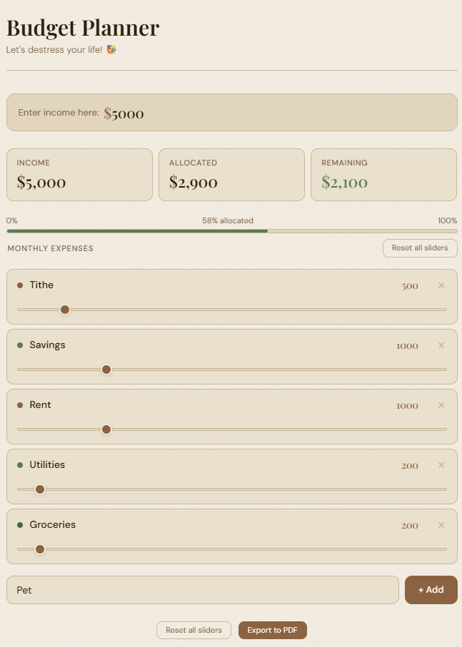

# Budget Planner

A free, interactive personal budget planner that runs entirely in your browser. No login required. No data collected. Everything stays on your device.

**[Try it live →](https://aodoom.github.io/Budget_Planner/)**

---

## What it does

Enter your monthly income and allocate it across your expense categories. The planner shows you in real time how much you've allocated, how much remains, and how close you are to your limit — so you can make intentional decisions about where your money goes before the month starts.

## Features

- **Enter your monthly income** — sliders and input fields automatically scale to your income as the maximum
- **Allocate by slider or direct input** — drag to set an amount or type it directly
- **Color-coded progress bar** — green when you have room, amber when you're above 90%, red when over budget
- **Add and remove categories** — customize the list to match your actual expenses
- **Rename any category** — click the label to edit it
- **Export to PDF** — generates a clean two-column summary with your allocation bar included

## How to use

1. Enter your monthly take-home income in the field at the top
2. Adjust the sliders or type amounts for each expense category
3. Watch the allocation bar and remaining balance update in real time
4. Add any categories that are missing using the input at the bottom
5. Export to PDF when your budget is set

## Planner Layout
   

## Privacy

This tool runs entirely in your browser. No data is sent to any server. Nothing is stored. Closing the tab clears everything.

## Built with

HTML · CSS · Vanilla JavaScript

---

*Built by [@aOdoom](https://github.com/aodoom)*
